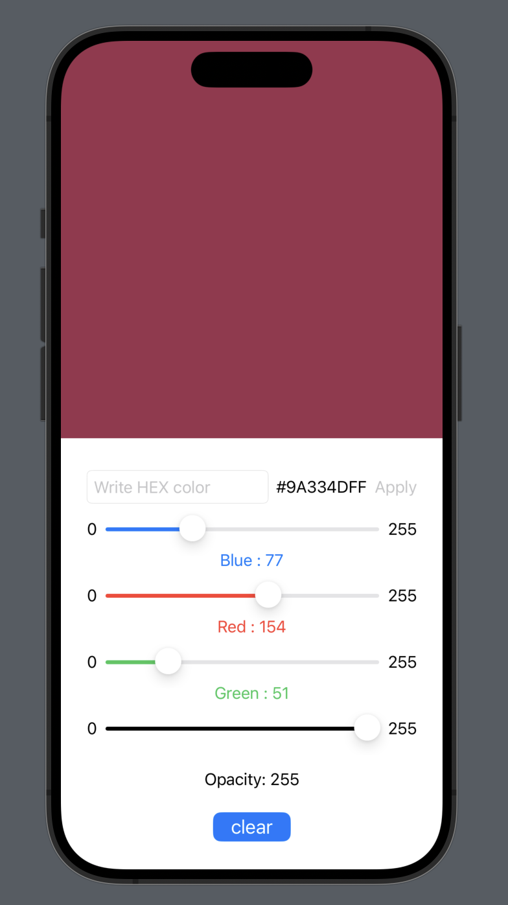

# Color picker

Welcome to the Swift Color Picker! In this an assignment, this is a color managment application to learn the function of the sliders, buttons and binding variables

## Features

- Sliders
- Buttons
- State variables
- Binding variables
- Color

## Lessons Learned

Whit this project I learned 

- Structure and use of Color.
- Connection between views
- Sliders and buttons
## Screenshots

## Support

For support, email montserrat.ga95@gmail.com Thanks✨

## Feedback

If you have any feedback, please reach out to me at montserrat.ga95@gmail.com

